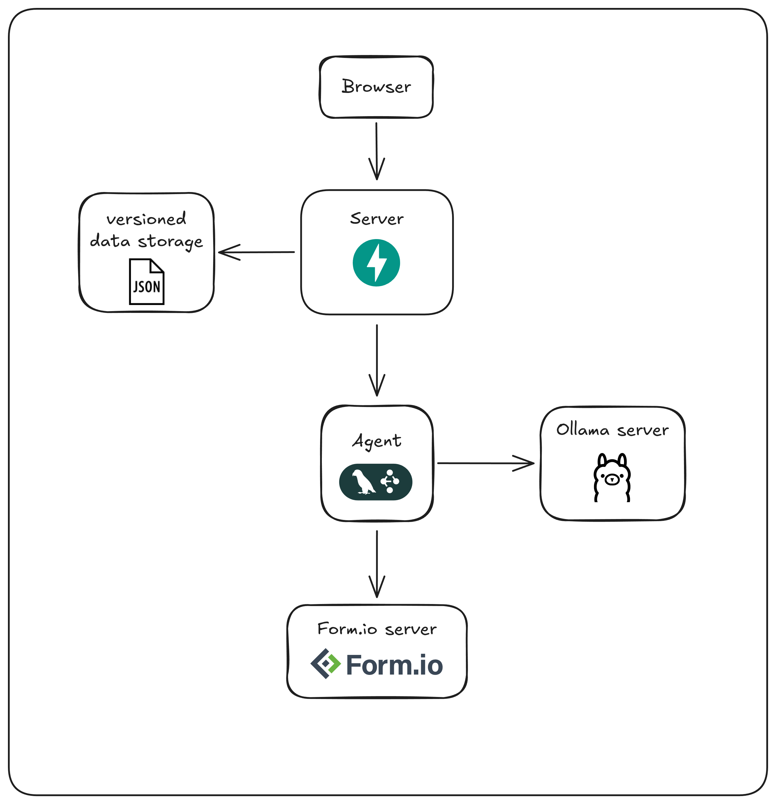
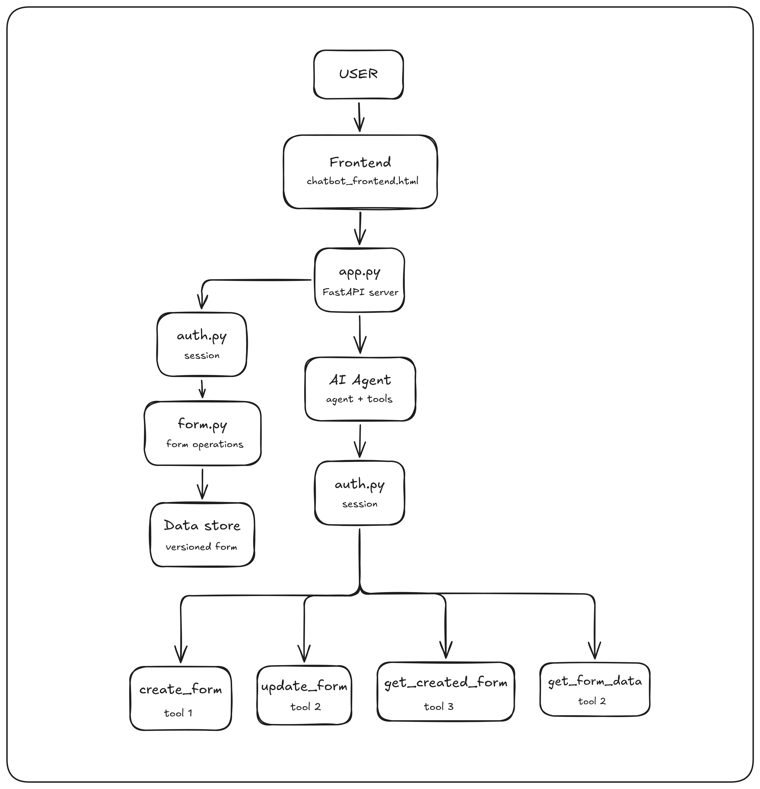

# ConversationalFormBuilder

An AI-powered, conversational, fully functional, editable form builder using Form.io-compatible schema, powered by a self-
hosted LLM.

---

## Architecture Diagram



---
<p>User sends request to the server from Browser. If the user is requesting new form, it is send directly to the agent for creating the form and then store the versioned form. If it is a request for editing a versioned form, the request firstly updates that version of form in the form.io and then sends the modification request to the agent and then store the updated version in the data storage.</p>

## Data Flow Diagram



---

## API Reference

### `GET /get_all_form_details`

Returns all forms currently stored, including their full version history.

**Response**

```json
{
    "data": [
        {
            "69f9dad394........": {
                "1": {
                    "_id": "69f9dad394........",
                    "title": <title_of_the_form>,
                    "name": <name_of_the_form>,
                    "path": <path_to_the_form>,
                    "type": <tpe_of_the_form>,
                    "display": "form",
                    "tags": [],
                    "owner": "69f9d3a0946.........",
                    "components": [
                        {
                            "input": <bool>,
                            "key": <name>,
                            "label": <lable_name>,
                            .
                            .
                        }
                    .
                    .
                }
            .
            .
            }
        }
    ]
}
```

---

### `POST /chat`

The core conversational endpoint. Accepts a natural language message (with optional images) and streams back the agent's response as Server-Sent Events (SSE).

**Request** — `multipart/form-data`

| Field | Type | Required | Description |
|---|---|---|---|
| `message` | `string` | ✅ | The user's natural language instruction |
| `form_id` | `string` | ❌ | ID of an existing form to edit |
| `version` | `integer` | ❌ | If provided, rolls the form back to this version before processing |
| `images` | `file[]` | ❌ | images to attach as context (e.g. a picture or screenshot) |

**Streaming Response** — `text/event-stream`

Each SSE event carries a JSON payload with a `type` field:

| `type` | Description | Example payload |
|---|---|---|
| `llm` | A streaming token from the LLM | `{ "type": "llm", "content": "Sure" }` |
| `tool_call` | The agent is invoking a tool | `{ "type": "tool_call", "tool": "create_form", "input": {...} }` |
| `tool_result` | Result after a tool finishes | `{ "type": "tool_result", "tool": "create_form", "output": {...} }` |

**Example — create a new form**

```bash
curl -X POST http://localhost:8000/chat \
  -F "message=Create a contact form with name, email, and a message field"
```

**Example — edit an existing form**

```bash
curl -X POST http://localhost:8000/chat \
  -F "message=Add a phone number field" \
  -F "form_id=abc123" \
  -F "version=2"
```

**Example — send an image mockup**

```bash
curl -X POST http://localhost:8000/chat \
  -F "message=Build a form that matches this mockup" \
  -F "images=@mockup.png"
```

> **Versioning note:** When `version` is supplied, the backend rolls the specified form back to that version before passing the request to the agent, allowing you to branch from any point in a form's history.

---

## Setup Guide

ConversationalFormBuilder uses a local LLM via [Ollama](https://ollama.com) as its inference backend and [Form.io](https://github.com/formio/formio) as the form engine.

### Prerequisites

- Docker installed and running
- Git
- Python 3.11+
- A modern web browser

---

### Step 1 — Run Form.io with Docker

Follow the official Form.io self-hosted setup:

```bash
git clone https://github.com/formio/formio.git
cd formio
# Follow the Docker setup instructions in their README
```

Make sure Form.io is accessible at `http://localhost:3001` before continuing.

---

### Step 2 — Clone This Repository

```bash
git clone https://github.com/thor-x-me/ConversationalFormBuilder_ooru_assignment.git
cd ConversationalFormBuilder_ooru_assignment
```

---

### Step 3 — Install Ollama

Download and install Ollama from [ollama.com/download](https://ollama.com/download), then pull the required model (I am using qwen3.5 here):

```bash
ollama run qwen3.5:latest
```

Type a test prompt to confirm inference is working, then exit with `Ctrl+D` or `/bye`.

---

### Step 4 — Set Up Python Environment

```bash
# Create and activate a virtual environment
python -m venv venv
source venv/bin/activate        # macOS / Linux
# venv\Scripts\activate         # Windows

# Install dependencies
pip install -r requirements.txt
```

---

### Step 5 — Run the Backend

```bash
uvicorn app:app
```

The API will be available at `http://localhost:8000`.

> If you change the port, make sure to update the frontend's API base URL to match.

---

### Step 6 — Open the Frontend

Open `frontend/index.html` directly in your browser (double-click or use **File → Open**). No build step required.

---

### Quick Reference

| Component | Default URL |
|---|---|
| Form.io API | http://localhost:3001 |
| Backend API | http://localhost:8000 |
| Ollama | http://localhost:11434 |
| Frontend | Open `chatbot_frontend.html` in browser |

---

### Troubleshooting

**Ollama not responding?**  
Make sure the Ollama service is running: `ollama serve`

**Backend 500 errors?**  
Confirm the model name in your code matches exactly: `qwen3.5:latest`

**Form.io connection issues?**  
Check that Docker containers are healthy with `docker ps` before starting the backend.

**Port conflicts?**  
Update the port in both the `uvicorn` startup command and the frontend's API base URL.